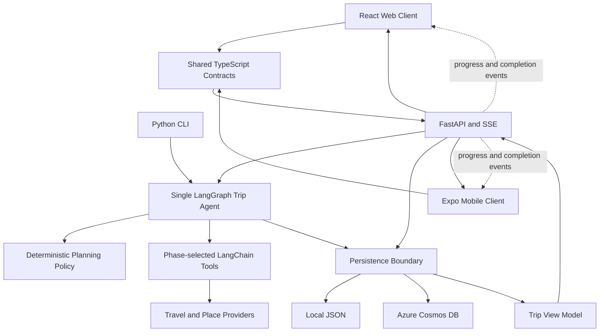
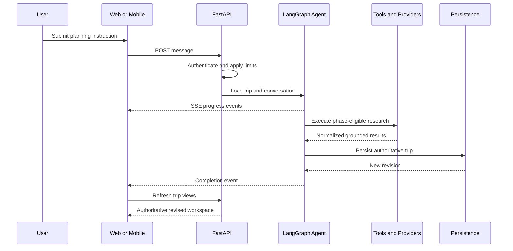

# Tripplanner Architecture Onboarding

> A guided introduction for software engineers joining the tripplanner project.
> This document explains how the system fits together and where to begin making
> changes. The canonical ownership map remains [`../CODEMAP.md`](../CODEMAP.md).

## 1. What Tripplanner Is

Tripplanner is a preference-aware AI trip planner that turns a short
conversation into a concrete, editable, and exportable trip. A completed plan can
include flights, hotels, attractions, meals, inter-city transport, weather,
practical guidance, and verified booking handoff material.

The product has three client surfaces:

- A React web application.
- An Expo/React Native mobile application for iPhone and Android.
- A Python command-line interface.

All clients use the same planning logic and persistence model. The key product
rule is that there is **one authoritative trip agent and one persisted trip**.
Itinerary, Map, Details, Assistant, web, and mobile are different ways of viewing
or modifying that same trip.

“Bookable” means concrete, grounded choices and useful provider handoff
information. The product does not currently charge cards or complete purchases
on external providers.

## 2. System at a Glance



The architecture intentionally combines probabilistic model behavior with
deterministic boundaries:

- The model researches and proposes a plan.
- Graph policy controls which tools are available and when work is complete.
- Critics and planning policy verify important quality constraints.
- Persistence revisions prevent stale writes.
- Clients refresh from the authoritative persisted trip after mutations.

## 3. Repository Shape

| Path | Responsibility |
| --- | --- |
| `src/tripplanner/` | Python backend, agent, tools, providers, persistence, and view models |
| `frontend/` | Production React web application and frontend tests |
| `mobile/` | Expo/React Native application |
| `packages/tripplanner-client/` | Shared web/mobile contracts and request behavior |
| `tests/` | Python unit and integration tests |
| `infra/` | Azure infrastructure and guarded deployment scripts |
| `scripts/` | Local development, diagnostics, synchronization, and sandbox tooling |
| `docs/` | Product truth, architecture, behavior contracts, and runbooks |

Production web code lives under `frontend/src/`. UX experiments under
`frontend/labs/` are isolated prototypes and are not production runtime code.

## 4. Backend Architecture

### 4.1 API and identity boundary

[`../../src/tripplanner/api.py`](../../src/tripplanner/api.py) owns FastAPI
routes, hosted identity enforcement, Server-Sent Events, and the production SPA
mount.

[`../../src/tripplanner/request_identity.py`](../../src/tripplanner/request_identity.py)
resolves signed Google identity, native bearer credentials, and scoped guest
capabilities. Never trust an account ID supplied directly by a caller. Guest
capability access and account ownership are separate concepts.

[`../../src/tripplanner/request_limits.py`](../../src/tripplanner/request_limits.py)
owns request limits, concurrency, and workspace exclusion.

### 4.2 Agent orchestration

[`../../src/tripplanner/graph.py`](../../src/tripplanner/graph.py) is the center
of planning. It runs the LangGraph model/tool loop, emits telemetry, and applies
deterministic completion gates.

Supporting modules have narrow ownership:

| File | Responsibility |
| --- | --- |
| [`graph_policy.py`](../../src/tripplanner/graph_policy.py) | Tool precedence, forced actions, completion requirements, and tool-phase budget |
| [`graph.py`](../../src/tripplanner/graph.py) | Shared graph state, merge behavior, and workflow composition |
| [`agents/trip_agent.py`](../../src/tripplanner/agents/trip_agent.py) | Agent instructions and prompt assembly |
| [`hallucination_critic.py`](../../src/tripplanner/hallucination_critic.py) | Deterministic grounding checks |

There is deliberately one trip agent. Do not introduce a router agent or a
separate personal-assistant agent. Tool schemas are selected by planning phase so
simple turns do not pay the context and latency cost of every provider tool.

### 4.3 Planning intelligence

[`../../src/tripplanner/planning_intelligence.py`](../../src/tripplanner/planning_intelligence.py)
contains deterministic trip-duration, personal day-capacity, and sparse-itinerary
policy. This logic should remain testable without an LLM.

[`../../src/tripplanner/platform_planning_insights.py`](../../src/tripplanner/platform_planning_insights.py)
is the privacy boundary for versioned aggregate planning priors. Another user's
itinerary must never be exposed or copied.

### 4.4 Tools and providers

[`../../src/tripplanner/tools/`](../../src/tripplanner/tools/) contains
LangChain `@tool` interfaces exposed to the agent. A tool owns the model-facing
operation and stable result contract.

[`../../src/tripplanner/providers/`](../../src/tripplanner/providers/) contains
normalized integrations with external travel and place providers. Provider HTTP
details, authentication, retries, and response normalization belong behind this
boundary rather than in graph logic.

The practical rule is:

```text
Agent decision -> stable tool contract -> provider implementation -> normalized result
```

### 4.5 Persistence

[`../../src/tripplanner/json_store.py`](../../src/tripplanner/json_store.py)
owns atomic local JSON persistence.
[`../../src/tripplanner/storage_cosmos.py`](../../src/tripplanner/storage_cosmos.py)
implements Cosmos-backed persistence. Configuration selects JSON or Cosmos
without changing business logic.

Cosmos containers have explicit ownership:

| Container | Data |
| --- | --- |
| `trips` | Trip documents and revisions |
| `conversations` | Assistant conversation state |
| `events` | Durable trip events and delivery metadata |
| `about_me` | User preference profiles |
| `email_exports` | Idempotent export records |
| `guest_credentials` | Scoped guest capability records |

Canary and production databases are isolated. Local emulator data is stateful and
must not be reset automatically.

### 4.6 Trip view-model boundary

[`../../src/tripplanner/web/trip_view.py`](../../src/tripplanner/web/trip_view.py)
converts persisted trip data into UI-independent itinerary, map, route, timing,
and display semantics.

```text
Persisted trip -> trip_view.py -> frontend-friendly itinerary/map/detail views
```

This is an important debugging boundary. If an airport, hotel marker, route,
stop time, or itinerary row is wrong in multiple clients, begin here. If the
backend view is correct and only React renders it incorrectly, continue into the
owning frontend component.

## 5. Frontend Architecture

### 5.1 Composition and state ownership

[`../../frontend/src/App.tsx`](../../frontend/src/App.tsx) is the web composition
root. It coordinates trip refreshes, mutations, workspace panes, and communication
among Itinerary, Map, Details, and Assistant.

State ownership is intentionally centralized:

| File | Responsibility |
| --- | --- |
| [`workspaceState.ts`](../../frontend/src/workspaceState.ts) | Canonical trip identity, revision, selection, and focus reducer |
| [`useWorkspaceFocus.ts`](../../frontend/src/hooks/useWorkspaceFocus.ts) | Mutually exclusive place, day, route, and circuit focus |
| [`useChatStream.ts`](../../frontend/src/hooks/useChatStream.ts) | SSE lifecycle, progress, cancellation, retry, and completion publication |

A critical invariant is that stale reads must never overwrite a newer trip,
revision, identity, focus, or mutation. Async work must be aborted or guarded by
the relevant generation, revision, or identity.

### 5.2 Major panes

| Pane | Primary owner |
| --- | --- |
| Itinerary | [`ItineraryPanel.tsx`](../../frontend/src/components/ItineraryPanel.tsx) and [`ItineraryStopRow.tsx`](../../frontend/src/components/ItineraryStopRow.tsx) |
| Map | [`MapPanel.tsx`](../../frontend/src/components/MapPanel.tsx) and [`components/map/`](../../frontend/src/components/map/) |
| Details | [`TripPanel.tsx`](../../frontend/src/components/TripPanel.tsx) and details shells |
| Assistant | [`ChatPanel.tsx`](../../frontend/src/components/ChatPanel.tsx) |

The panes are synchronized presentations of one trip. A place selected in the
Itinerary can focus the corresponding Map occurrence and contextual Details.
Transport circuits preserve their endpoints and ordered route geometry.

Desktop pane visibility is independent and persisted locally. Any combination,
including all panes hidden, is valid; the command bar remains available to restore
them. The Assistant is a mounted lower-right overlay so closing it does not erase
conversation state.

### 5.3 Shared client and mobile

[`../../packages/tripplanner-client/`](../../packages/tripplanner-client/) owns
cross-platform TypeScript contracts, SSE parsing, request helpers, workspace
revisions, and serialized mutations.

[`../../mobile/`](../../mobile/) is a native presentation and device-adapter
layer. It should reuse shared contracts and backend planning behavior, not copy
web components or duplicate trip logic.

## 6. Core Data Flows

### 6.1 Assistant planning turn



Planning completion is not merely model text. The trip must be persisted, and the
client announces readiness only after the authoritative refreshed view loads.

### 6.2 Map, Details, or Itinerary mutation

```text
User action
  -> shared client request with expected trip revision
  -> API authorization and validation
  -> persisted mutation
  -> new revision and revised trip view
  -> one canonical workspace state update
```

The expected revision is an optimistic concurrency boundary. A stale write must
fail rather than overwrite newer work.

### 6.3 Preference update

```text
Conversation or explicit edit
  -> extract structured preference
  -> additive merge
  -> persist About Me profile
  -> apply at relevant planning boundaries
```

Preference removal must be explicit. Normal extraction and application are
additive so new information does not silently erase prior context.

## 7. Contracts You Must Preserve

1. **One agent:** planning remains in one LangGraph trip agent.
2. **One authoritative trip:** all panes and clients refresh from persisted state.
3. **Revision safety:** stale reads and writes cannot replace newer state.
4. **Identity safety:** identity comes from verified credentials or guest capabilities.
5. **SSE stability:** event names and payloads are client contracts.
6. **Provider isolation:** external API details remain behind tools/providers.
7. **Cross-platform contracts:** shared behavior belongs in `tripplanner-client`.
8. **Persistence portability:** JSON and Cosmos remain selectable.
9. **Environment isolation:** local, canary, and production data stay separate.
10. **Deployment immutability:** production promotes the exact canary-tested image.

Observable interaction contracts and regression IDs are maintained in
[`../EXPECTED_BEHAVIORS.md`](../EXPECTED_BEHAVIORS.md).

## 8. Where to Start for Common Changes

| Change | Start here |
| --- | --- |
| Agent loop or completion behavior | [`graph.py`](../../src/tripplanner/graph.py) and [`graph_policy.py`](../../src/tripplanner/graph_policy.py) |
| Model instructions | [`agents/trip_agent.py`](../../src/tripplanner/agents/trip_agent.py) |
| New model-facing operation | [`tools/`](../../src/tripplanner/tools/) |
| External travel integration | [`providers/`](../../src/tripplanner/providers/) |
| API, authentication, or SSE | [`api.py`](../../src/tripplanner/api.py) |
| Trip duration or itinerary policy | [`planning_intelligence.py`](../../src/tripplanner/planning_intelligence.py) |
| Itinerary/map data semantics | [`trip_view.py`](../../src/tripplanner/web/trip_view.py) |
| Web workspace coordination | [`App.tsx`](../../frontend/src/App.tsx) |
| Itinerary presentation | [`ItineraryPanel.tsx`](../../frontend/src/components/ItineraryPanel.tsx) |
| Map behavior | [`MapPanel.tsx`](../../frontend/src/components/MapPanel.tsx) and [`components/map/`](../../frontend/src/components/map/) |
| Shared web/mobile behavior | [`tripplanner-client/`](../../packages/tripplanner-client/) |
| Native presentation | [`mobile/`](../../mobile/) |
| Azure release | [`../operations/deployment-flow.md`](../operations/deployment-flow.md) |

## 9. Debugging by Symptom

| Symptom | First boundary to inspect |
| --- | --- |
| Model selected the wrong tool | Graph policy, current graph phase, and prompt |
| Provider returned malformed or missing data | Provider adapter and normalized tool result |
| Persisted trip is incomplete | Planning completion gates and persistence tool |
| Backend itinerary and map are both wrong | `trip_view.py` |
| Backend response is correct but one pane is wrong | Owning React component |
| Old trip data appears after switching trips | Request abort/revision/identity guards |
| Itinerary focus does not match Map or Details | Workspace focus reducer and occurrence identity |
| Duplicate mutation or export | Serialized mutation or external-operation idempotency |
| Local behavior differs from hosted | Configuration and JSON/Cosmos selection boundary |

Prefer tracing one user action through its owning path over broadly searching the
repository.

## 10. Documentation Authority

The small canonical set prevents architecture truth from being scattered:

| Document | Answers |
| --- | --- |
| [`../PRODUCT.md`](../PRODUCT.md) | What are we building and what should it feel like? |
| [`../CODEMAP.md`](../CODEMAP.md) | Where does behavior belong and what contracts are stable? |
| [`../EXPECTED_BEHAVIORS.md`](../EXPECTED_BEHAVIORS.md) | What must users observe? |
| [`../REQUIREMENTS.md`](../REQUIREMENTS.md) | What is implemented, guarded, proposed, or out of scope? |
| [`../ENGINEERING_LEARNINGS.md`](../ENGINEERING_LEARNINGS.md) | What durable lessons came from actual failures? |

Roadmap entries are candidates, not approval. An owner-approved feature brief
defines active scope. UX Labs evaluate presentation choices outside production.

## 11. Development and Validation

Run the narrowest check that exercises your changed boundary, then broaden at the
milestone level.

```powershell
# Python tests
.venv\Scripts\python.exe -m pytest -q

# Python lint
.venv\Scripts\python.exe -m ruff check src tests

# Frontend typecheck, tests, and build
npm --prefix frontend run typecheck
npm --prefix frontend test -- --run
npm --prefix frontend run build

# Shared client
npm --prefix packages/tripplanner-client test

# Mobile
npm --prefix mobile run typecheck
npm --prefix mobile run lint

# Patch hygiene
git diff --check
```

Worker agents use server-free validation by default. The primary MasterAgent
workspace owns shared local-stack startup, shutdown, and manual-test health.

## 12. Deployment Model

The release process is deliberately guarded:

1. Image publication is manual.
2. Canary builds an immutable image tagged with the current Git SHA.
3. Canary smoke testing validates that exact image.
4. Production promotes the already-tested image without rebuilding it.
5. Production requires explicit owner approval and the exact approval phrase.
6. Rollback activates a prior revision; it does not undo data writes.

Follow [`../operations/deployment-flow.md`](../operations/deployment-flow.md)
rather than improvising deployment commands.

## 13. Suggested First Week

### Day 1: Understand product and contracts

Read, in order:

1. [`../PRODUCT.md`](../PRODUCT.md)
2. [`../CODEMAP.md`](../CODEMAP.md)
3. [`../EXPECTED_BEHAVIORS.md`](../EXPECTED_BEHAVIORS.md)
4. [`../REQUIREMENTS.md`](../REQUIREMENTS.md)

### Day 2: Trace one planning turn

Follow a chat request through `ChatPanel`, `useChatStream`, FastAPI, the graph,
one tool, persistence, and the final workspace refresh.

### Day 3: Trace one visual focus action

Follow an itinerary stop click through workspace focus, Map occurrence matching,
and Details rendering. Notice how day and stop position disambiguate repeated
places.

### Day 4: Run focused tests

Choose one backend and one frontend ownership boundary. Run their focused tests,
make a harmless local observation, and understand how test fixtures represent a
trip.

### Day 5: Make one narrow change

Start from an expected behavior, edit the owning module, add focused regression
coverage, validate, and update the canonical document only if the behavior or
architecture actually changed.

## 14. Final Mental Checklist

Before changing code, ask:

- Which module owns this behavior?
- Is this product intent, observable behavior, or implementation detail?
- Does the change affect shared web/mobile contracts?
- Could a stale request overwrite newer state?
- Does persistence need an expected revision?
- Is provider logic leaking into graph or UI code?
- What is the cheapest focused test that can disprove my hypothesis?
- Which canonical document, if any, must change with the code?

If those answers are clear, you are usually at the correct implementation
boundary.
