# 003 — Decision records: the plan explains and defends itself

## Document control

| Field | Value |
|---|---|
| Brief ID | `003` |
| Status | Draft — awaiting owner approval to implement |
| Owner | Munish Goyal |
| Created | 2026-08-08 |
| Updated | 2026-08-08 |
| Baseline | `docs/REQUIREMENTS.md` at `master` `eec5e34` |
| Target milestone | M1 of 4 (see Delivery) |
| Related | Lab 22 option E, implemented in sandbox `1-lab22-liveplan` as `frontend/src/publicEntry/` |

## One-sentence requirement

As the traveller, I need the planner to keep what it chose, what it rejected, why,
and where each number came from, so that I can check its reasoning, disagree with
one specific choice, and see exactly what my disagreement costs.

---

## 1. Why now

Lab 22 asked what makes a stranger trust an AI planner in ten seconds. The answer
that survived five options was: *let them watch it decide, then let them overrule
it.* Option E was selected and is now built as the public entry page.

The page is currently driven by a captured fixture, because **the product cannot
do what the page shows.** That is the trigger for this brief. The gap is not
cosmetic:

| The page claims | Reality today | Evidence |
|---|---|---|
| "Flight, rail, road and coach — priced on every hop" | No comparison exists. One mode per call, loser never stored. Rail and coach have no fare source at all. | `src/tripplanner/tools/routing.py` `compute_route` takes a single `mode` |
| "It chose the train, here is the rule, overrule it" | Rationale is disposable LLM prose. `trip_guard` computes `reasons` in memory and drops them. | `src/tripplanner/tools/trip_guard.py` `Rejection.reasons` |
| "€4,180 first → €3,764 best, saved €416" | No first-vs-current concept. Only `total_cost` and `budget`. | `src/tripplanner/tools/trip_planner.py` plan dict |
| "Every number carries its source, checked 11 min ago" | Offers carry `provider` / `quoted_at` / `expires_at`; all dropped when selected. | `src/tripplanner/providers/models.py` vs `selected_*` entries |
| The live receipt stream | `tool` SSE events carry a name and a 160-char arg preview only. | `src/tripplanner/api.py` `_summarize_tool_input` |

Two of these are plumbing. Two are missing capabilities. One — mode comparison —
does not exist in any form.

**The owner's position, recorded 2026-08-08:** what we show users, the product
must actually do. This brief is the work that makes that true.

## 2. User problem

The planner currently behaves like a confident stranger. It produces an itinerary
and a total, and if you doubt one line of it your only recourse is to argue in
chat and hope the re-plan does not damage everything else. You cannot see what it
considered. You cannot see what it rejected. You cannot tell whether a price was
fetched two minutes ago or invented.

For a preference-aware planner this is the central failure. The whole value
proposition is *it knows how I travel* — and a claim you cannot inspect is
indistinguishable from a guess.

## 3. Desired outcome

Every consequential choice in a trip becomes an inspectable, reversible record.
The traveller can open any leg and see the four ways to make it, what each costs
and takes door to door, which one was chosen, under what rule, and which source
each number came from and when. Disagreeing is one click, the plan re-settles
around the disagreement, the cost delta is shown honestly, and putting it back
is one click.

Downstream, the public entry page, the receipt stream, and the share page stop
being illustrations and become views over real data.

## 4. Must-have scenarios

1. **Intercity leg.** A Lisbon→Porto trip. The planner compares rail, air, road
   and coach, picks rail on whole-journey time, and the trip stores all four
   options with prices, durations and sources.
2. **Disagreement.** The traveller clicks "I would rather fly it." The leg
   becomes the flight, the total moves to the flight's total with a visible
   delta, day 3 is re-shaped, and a warning names what was lost. "Put it back"
   restores the rail version intact.
3. **Awkward edge — no fare available.** Portuguese rail has no bookable API in
   this product. The comparison must still happen and still be useful: the rail
   option shows its duration, transfers and day impact, and **shows no price at
   all**. It must never carry an invented number, and the decision must not fail
   because one row is unpriced.
4. **Awkward edge — stale decision.** A trip planned three weeks ago is reopened.
   Its quotes have expired. The decision still renders, but every price is marked
   as of its capture date and no expired number claims to be current.
5. **Old trip.** A trip created before this feature has no decisions. It renders
   exactly as it does today, with no empty section and no error.

## 5. Boundaries

- Must not change: the single LangGraph trip agent with phase-selected tools. No
  new agent, no router.
- Must not change: Assistant builds, Details/Map refine. Decisions are shown and
  overruled in the workspace; they are not a new fourth pane.
- Must not add: provider-side purchase, payment or cancellation. Overruling
  changes the plan, never a booking.
- Must not add: a code generator for the Python↔TypeScript contract. It is
  hand-written today and stays hand-written.
- Requires approval first: any new paid provider (rail/coach pricing), and any
  change to the canonical local stack.
- The captured-replay public entry stays honest until this ships. It currently
  says the run was captured. That copy only changes when the engine is real.

---

# High-level design

## The spine

One idea carries the whole feature: **a decision is a record, not a sentence.**

```mermaid
flowchart TB
  subgraph agent["Trip agent (unchanged loop)"]
    T1[compare_transport_options]
    T2[search_flights / search_hotels]
    T3[update_trip_plan]
  end

  subgraph rules["decisions/ (pure, no I/O)"]
    R1[rank options<br/>door-to-door rule]
    R2[cost baseline + delta]
    R3[receipt projection]
  end

  subgraph trip["Persisted trip document"]
    D[(decisions&#91;&#93;)]
    C[(cost_baseline)]
    S[(selected_* + source)]
  end

  subgraph surfaces["Read surfaces"]
    V[trip_view build_view]
    E[SSE receipt events]
    H[share snapshot HTML]
    P[public entry page]
  end

  T1 --> R1 --> D
  T2 --> S
  T3 --> R2 --> C
  D --> R3 --> E
  D --> V
  C --> V
  S --> V
  V --> P
  D --> H
```



Three principles hold the design together:

1. **The rule engine is pure.** Ranking, cost deltas and receipt text are
   functions of data with no network and no model call, in a new
   `src/tripplanner/decisions/` package. That is where the tests live, without
   mocks, matching the existing convention.
2. **Persistence is additive.** Two new optional top-level trip fields. Every
   existing reader keeps working; every existing trip stays valid.
3. **The UI never invents confidence.** A number's rendering is derived from its
   `confidence` and `checked_at`, not chosen by the component. An estimate cannot
   accidentally be drawn as a live quote.

## What is genuinely new versus plumbing

| Work | Nature | Risk |
|---|---|---|
| Transport mode comparison | **New capability.** No equivalent exists. | High — needs multi-provider fan-out and a rail/coach data answer |
| Decision records + rule engine | **New data + pure logic.** | Medium — schema is permanent, get it right once |
| Overrule and re-settle | **New capability.** Mutation with conflict rules. | Medium-high — must not corrupt a plan |
| Cost baseline and delta | Small addition | Low |
| Provenance on selections | **Plumbing.** Data already exists and is discarded. | Low |
| Receipt SSE events | **Plumbing.** Stream exists, payload is thin. | Low |
| Share and public entry surfaces | Views over the above | Low |

The honest ranking of value per unit of risk: provenance and receipts are cheap
and immediately visible; the decision spine is the thing worth building
carefully; mode comparison is the one that can fail on an external dependency.

## The dependency, and the owner's answer to it

**There is no rail or coach pricing API in this product.** Google Routes TRANSIT
returns duration and legs, not fares. Duffel and Amadeus cover air only.

**Owner decision, 2026-08-08:** build the capability behind a source port, and
when no reliable source can answer, *behave as if rail and coach pricing is not
supported* — compare on time, transfers and day impact, and show no price at
all. Do not estimate. Integrating a commercial provider is a separate decision.

This is the stronger answer and it simplifies the design: **there is no
`estimated` price tier.** A price is either a real quote from a real source, or
it is absent. `Option.price` is nullable, and every consumer — the ranker, the
view model, the share page, the public entry — must handle an unpriced option as
a first-class case rather than an error state.

The practical effect on the product claim: it is not "priced on every hop", it is
**"every hop compared, and priced wherever a real fare exists"**. That sentence
is true today, stays true when a provider is added, and never has to be walked
back.

### Provider candidates for the separate decision

Recorded here so the port is shaped to fit them, not integrated in this brief:

| Candidate | Coverage | Shape it implies |
|---|---|---|
| **Omio** | Rail, coach and air across Europe and North America, aggregated | Multi-mode in one call — the port must allow one source to answer several modes |
| **Trainline / Rail Europe** | Authoritative European rail retailing and fares | Rail only, per-operator; the port must allow mode-specific registration |
| **Rome2rio** | Multimodal, *price ranges* rather than bookable fares | Ranges, not points — if adopted, `Money` needs a range variant, and a range must never be rendered as a fixed price |

The last row is the reason the port returns a `FareQuote` rather than a bare
number: a range from Rome2rio and a bookable fare from Trainline are different
kinds of truth and must stay distinguishable all the way to the pixel.

---

# Low-level design

## D1. Data model

Two new optional top-level fields on the trip document. Nothing existing changes.

### `decisions: list[Decision]`

```jsonc
{
  "id": "dec_lisbon_porto_d3",        // deterministic: kind + scope, stable across re-saves
  "kind": "transport_mode",           // transport_mode | lodging | flight | day_shape
  "created_at": "2026-10-02T09:14:03",
  "scope": { "day": 3, "from": "Lisbon", "to": "Porto", "date": "2026-10-15" },
  "subject": "Lisbon → Porto, on day 3",
  "rule": {
    "code": "door_to_door_time",
    "text": "Whole-journey time, not the time in the air"
  },
  "chosen_option_id": "opt_rail_ap",
  "options": [ /* Option[], 2..6 */ ],
  "state": "agent",                   // agent | overruled
  "override": null,                   // OverrideRecord | null
  "effect": { "total_cost": 3764, "currency": "EUR" },
  "priced": "partial"                 // full | partial | none — how much of the comparison carried a real fare
}
```

### `Option`

```jsonc
{
  "id": "opt_rail_ap",
  "mode": "train",                    // flight | train | road | coach | ferry | metro | walk
  "label": "Alfa Pendular",
  "detail": "Santa Apolónia → Campanhã, hourly",
  "price": { "amount": 62, "currency": "EUR", "basis": "per_traveller" },
  "priced": true,                     // false => price is null and stays null
  "unpriced_reason": null,            // "no_source" | "source_failed" | "out_of_coverage"
  "duration_min": 175,                // in-vehicle
  "door_to_door_min": 215,            // includes access, check-in, egress — the ranked value
  "day_cost": 0.35,                   // fraction of a usable day consumed
  "rejected_because": "Costs €94 more and turns day 3 into a transfer day.",
  "source": {
    "provider": "duffel",
    "url": null,
    "checked_at": "2026-10-02T09:13:58",
    "expires_at": "2026-10-02T09:43:58",
    "confidence": "live"              // live | cached  — there is no estimated tier
  }
}
```

An unpriced option carries `price: null`, `priced: false`, a reason, and a
`source` whose provider is `null`. It still carries duration and day impact,
because that is the part we genuinely know.

`door_to_door_min` is the single most important field in the schema. It is what
makes the planner's reasoning defensible, and it is the reason a 55-minute flight
loses to a 2h55 train.

### `OverrideRecord`

```jsonc
{
  "option_id": "opt_air_tap",
  "at": "2026-10-02T09:20:11",
  "previous_option_id": "opt_rail_ap",
  "effect": { "total_cost": 3858, "delta": 94, "currency": "EUR" },
  "warnings": ["Two of the five days now contain a transfer."]
}
```

Keeping `previous_option_id` and the prior effect on the record is what makes
"Put it back" exact rather than a re-plan.

### `cost_baseline`

```jsonc
{
  "first":   { "amount": 4180, "currency": "EUR", "at": "2026-10-02T09:02:11" },
  "current": { "amount": 3764, "currency": "EUR", "at": "2026-10-02T09:19:02" },
  "reason": "rail over air on day 3; hotel swap in Porto"
}
```

`saved` is derived, never stored. `first` is written exactly once, at the first
save where `total_cost > 0`, and is immutable thereafter.

### `selected_*` provenance

Each entry in `selected_flights` / `selected_hotels` / `selected_activities`
gains one optional `source` object with the same shape as `Option.source`,
populated from the offer's existing `provider`, `provider_ref`, `quoted_at`,
`expires_at`, `status`. This is a two-line change at each conversion site and it
is the highest value-per-line work in the brief.

### Size and retention

Cosmos documents are capped at 2 MB and the active trip is a single document.
Bounds, enforced on write:

- max **6** options per decision (the ranker keeps the chosen plus the 5 best rejected)
- max **40** decisions per trip
- `rejected_because` truncated at 240 chars, `detail` at 120

Worst case ≈ 40 × 6 × ~400 B ≈ 96 KB. Acceptable. When the decision cap is hit,
the oldest decision whose `state` is `agent` and whose scope no longer exists in
the itinerary is pruned first.

## D2. `src/tripplanner/decisions/` — the pure core

New package. No network, no model, no storage. Fully unit-testable.

| Module | Responsibility |
|---|---|
| `models.py` | Pydantic `Decision`, `Option`, `Source`, `OverrideRecord`, `CostBaseline`; parse/serialise from the trip dict |
| `rules.py` | `rank(options, prefs) -> RankResult`, the door-to-door rule and its explanation text |
| `apply.py` | `apply_override(trip, decision_id, option_id) -> ApplyResult`; `restore(trip, decision_id)` |
| `baseline.py` | `update_baseline(trip)`; delta computation |
| `receipts.py` | `receipt_for(tool_name, tool_output) -> Receipt \| None` |
| `prune.py` | Size and retention enforcement |

### `rules.rank`

```python
def rank(options: list[Option], prefs: TransportPrefs) -> RankResult:
    """Pick a transport option and produce the sentence that defends the pick."""
```

Scoring, in order of weight:

1. **Door-to-door time.** The dominant term. A mode that saves in-vehicle time
   but loses it to access and check-in does not win.
2. **Day integrity.** `day_cost` — an option that consumes a usable day of a
   5-day trip is penalised hard. This is what makes the Lisbon→Porto answer come
   out right for a human reason rather than a numeric coincidence.
3. **Price**, normalised against the trip's `budget_level`. **Unpriced options
   are ranked on time and day impact alone and are never penalised for having no
   price.** If the winner is unpriced, the rule text says the choice was made on
   time because no fare was available — it does not imply the choice was cheap.
4. **Stated preference.** `preferences_snapshot.transport_preferences` — a
   traveller who has said they dislike driving gets that respected, and the rule
   text says so out loud.

`RankResult` carries the chosen option, the rule code, the human sentence, and a
`rejected_because` line per loser. **The sentences are generated here, not by the
model,** so they cannot drift from the numbers they describe.

Ties and near-ties (within 5%) resolve to the lower-carbon / lower-hassle option
and the rule text says "close call" rather than pretending to certainty.

## D3. New tool: `compare_transport_options`

New file `src/tripplanner/tools/transport_compare.py`.

```python
@tool
def compare_transport_options(
    from_place: str,
    to_place: str,
    date: str,
    travellers: int = 1,
    day: int = 0,
) -> str:
    """Compare every sensible way to make one intercity hop, and record the choice.

    Call once per hop between two cities or regions, before placing the transfer
    in the itinerary. Returns the ranked options and the decision id. Do not call
    for movement inside one city — use optimize_day_route for that.
    """
```

**Fan-out**, concurrent, each independently degradable:

| Mode | Duration source | Fare source today | If no fare |
|---|---|---|---|
| Road | Routes API `DRIVE` | none | unpriced, `no_source` |
| Rail / coach | Routes API `TRANSIT` | none registered | unpriced, `no_source` |
| Air | Duffel / Amadeus segments | `search_flights_duffel`, falling back to `search_flights` | unpriced, `source_failed` |

Fares come from a registry, not from the tool. `src/tripplanner/providers/fares.py`
defines the port:

```python
class FareSource(Protocol):
    modes: frozenset[str]
    name: str
    def quote(self, req: FareRequest) -> FareQuote | None: ...
```

`FareQuote` carries `amount | range`, `currency`, `basis`, `provider`,
`quoted_at`, `expires_at`. The registry is ordered; the first source covering the
mode that returns a quote wins. **Today only the air source is registered, and
the rail/road/coach rows come back unpriced by design.** Adding Omio or Trainline
later is one new module plus one registry line — no change to the tool, the
ranker, or any surface.

Door-to-door is computed by adding fixed, documented access constants per mode
(air: 120 min airport overhead plus city-to-airport transfer from Routes; rail:
20 min; road: 0) in `rules.py` — visible, testable numbers, not model guesses.

**Registration:** append to `_SEARCH_TOOLS` in
`src/tripplanner/agents/trip_agent.py`, and to `COMPLETION_RESEARCH_TOOLS` in
`src/tripplanner/graph_policy.py` so the existing completion gates count it.

**Guards**, because this tool fans out to several paid providers:

- Skip and return a cheap answer when the two places are under 40 km apart.
- Cache by `(from, to, date, travellers)` for 24 h.
- Hard ceiling of **6** comparisons per trip and **3** per turn.
- Any single provider failure degrades that row to "not priced" — never fails the
  tool. A comparison of three modes is still worth having.

The tool **writes the decision itself** in `state: "agent"`. It does not wait for
the model to remember to record it, because a decision that depends on the model
choosing to persist it is exactly the failure mode we have today.

## D4. Overrule: API and mutation

```
POST   /trip/decisions/{decision_id}/override   { "option_id": "opt_air_tap" }
DELETE /trip/decisions/{decision_id}/override
```

Both return the updated `TripView` plus the `ApplyResult` summary, so the client
performs one round trip and the single state owner in the React workspace takes
one coherent update.

`apply.apply_override` is **deterministic — no model call.** It:

1. Locates the transfer stop for the decision's scope in `day_wise_itinerary`.
2. Replaces mode, label, duration and times; shifts subsequent stops on that day
   by the duration difference.
3. Recomputes `total_cost` through the existing `web/budget.py` aggregation.
4. Runs the existing `trip_guard` validation and captures its `reasons` as the
   override's `warnings` — this is the first time those reasons are persisted
   rather than discarded.
5. Writes `override`, flips `state`, updates `cost_baseline.current`.

If the guard reports a **hard** conflict (a stop now closed, a flight missed),
the override is still applied — the traveller asked for it — but the warning is
returned and shown prominently. The product does not silently refuse a
traveller's stated preference, and it does not silently hide the consequence.

**Concurrency.** The request carries the trip's `updated_at`; a mismatch returns
`409` with the current view, and the client re-renders rather than overwriting
newer state. This is the existing stale-write invariant in the React workspace
and it must not be broken by a new mutation.

Deeper re-planning (re-shaping the whole day around the new mode) is deliberately
**not** in M1. It is the agent's job, reachable by the traveller sending "now
re-plan day 3 around the flight", and it is a Should-ship follow-up.

## D5. Receipt events

New SSE event, emitted alongside the existing `tool` event, which is unchanged
for back-compat.

```
event: receipt
data: {"seq":9,"at":"0:33","kind":"transport","text":"Compared 4 ways from Lisbon to Porto",
       "detail":"rail picked · 3 rejected","decision_id":"dec_lisbon_porto_d3",
       "source":"Duffel","priced":"partial"}
```

`decisions/receipts.py` maps a completed tool call to a receipt or to `None`.
Pure function, table-driven, unit-tested — the projection is data, not scattered
`if` statements in the API layer.

Frontend: `frontend/src/hooks/useChatStream.ts` gains an `onReceipt` handler
appending to a `receipts` array. The workspace renders them where the current
progress label is; the public entry renders them as the live console. Same event,
two presentations, one truth.

## D6. View model and TypeScript contract

`src/tripplanner/web/trip_view.py` `build_view` gains:

- `decisions: DecisionView[]` — sanitised for display: no `provider_ref`, source
  URL kept only when it is a public page.
- `overview.cost_baseline: {first, current, saved, currency} | null`
- each itinerary transport stop gains `decision_id: string | null` so the UI can
  anchor the "why" affordance to the leg it belongs to.

Mirror by hand in `packages/tripplanner-client/src/types.ts`, as today. All new
fields optional so the mobile client compiles untouched.

## D7. Share

Add `decisions` and `cost_baseline` to the allowlist in
`src/tripplanner/web/share.py` `sanitize_plan`, through a dedicated
`sanitize_decisions()` that strips `provider_ref`, any URL carrying a key or
affiliate parameter, and internal rule codes. The share HTML is pre-built at mint
time by `itinerary_export.py`, so a "Why it is planned this way" section is added
to that template.

Shared decisions are **read-only**. A viewer sees what was chosen and rejected;
they cannot overrule someone else's trip.

## D8. Public entry

Once M1–M3 land, `frontend/src/publicEntry/demoRun.ts` stops being hand-written
data and becomes a **captured real run** — the same shapes, exported from an
actual trip. The page's honesty copy stays accurate ("captured and replayed"),
because that is still what it is; what changes is that the claims it makes about
the engine become true.

---

## Acceptance criteria

- **AC-01** A trip with an intercity hop stores a `transport_mode` decision with
  at least two options, each carrying `door_to_door_min` and a `source`.
- **AC-02** An option with no available fare renders with its duration and day
  impact and **no price and no placeholder number** on every surface, and the
  decision still ranks and displays normally.
- **AC-02b** No code path produces a price without a `source.provider` and a
  `checked_at`. Asserted by a test that walks every option of a built decision.
- **AC-03** `rank()` prefers rail over air on a hop where rail's door-to-door
  time is lower, and its returned sentence cites the door-to-door rule. Pure
  unit test, no mocks.
- **AC-04** Overriding a decision returns a trip whose `total_cost` equals the
  chosen option's total, with a non-empty `delta`, in one round trip.
- **AC-05** Restoring an override returns the trip to the exact prior
  `total_cost` and itinerary shape.
- **AC-06** An override that creates a conflict returns a warning naming the
  specific casualty, and still applies.
- **AC-07** An override request carrying a stale `updated_at` returns 409 and the
  current view, and does not mutate the trip.
- **AC-08** A trip document saved before this feature loads, renders and can be
  edited with no error and no empty decision UI.
- **AC-09** Every live price the planner obtains records the provider and the
  moment it was obtained, and once that record has aged out the figure is never
  described as current. Implemented as a plan-level price-check ledger rather
  than per-selection fields: `_format_offers` emits no offer identifier, so
  there is no key on which to join a stored selection back to the quote that
  produced it, and inventing one would be provenance in name only.
- **AC-10** A run emits `receipt` events whose count equals the number of
  receipt-mapped tool calls, and the existing `tool` events are unchanged.
- **AC-11** A shared snapshot shows decisions without `provider_ref` or keyed
  URLs, and offers no override control.
- **AC-12** A trip cannot exceed 40 decisions or 6 options per decision, verified
  by a pruning unit test.
- **AC-13** No comparison is issued for a hop under 40 km, and no more than 6 per
  trip.

## Validation matrix

| Layer | Required check | Evidence |
|---|---|---|
| Pure/domain logic | `tests/test_decision_rules.py`, `test_decision_apply.py`, `test_decision_receipts.py`, `test_decision_store.py` — no mocks | M3 done: `test_decision_rules.py` (9), `test_decision_store.py` (8), `test_decision_apply.py` (11), `test_decision_receipts.py` (11) pass |
| Backend contract | `tests/test_decisions_api.py` — override, restore, 409, sanitised view | M3 done: `test_decisions_api.py` (6) plus `test_receipt_stream.py` (2) — a receipt only for verifiable work, `tool` events unchanged |
| Fare port | `tests/test_fare_sources.py` — empty registry yields unpriced, air source yields a sourced quote, failure degrades | M1 done: 6 tests pass |
| Tool | `tests/test_transport_compare.py` — fan-out with stubbed providers, partial-failure degradation, cache, ceilings | M1 done: 10 tests pass |
| Persistence | extend `tests/test_trip.py` — additive fields, old-document compatibility | M3 done: full suite 1008 passed, no regression; malformed decision and price-check rows skipped |
| Share | extend `tests/test_share.py` — allowlist, provenance stripping | M3 done: 12 tests pass — `provider_ref` and `day_cost` dropped, keyed URLs dropped, the overruled choice shown, `price_checks` carried |
| Web behavior | new vitest for the decision panel, override, undo, confidence rendering | M3 done: `DecisionPanel.test.tsx` (8) including the stale-price line, `api.test.ts` receipt dispatch; frontend suite 270 passed |
| Shared client | type compile of `packages/tripplanner-client` | M3 done: `npx tsc -b --noEmit` clean |
| Mobile | `tsc` only; no mobile UI in this increment | M3 done: `Receipt`, `ProvenanceRow` and `onReceipt` are optional additions; no mobile change |
| Accessibility | override control keyboard-reachable, warning announced via live region | M2 done: overrule and undo are native buttons; warnings render through the existing notice channel |
| Build | `npm run build`, `pytest` | M4 done: `pytest` 1014 passed; sandbox `npm run build` clean, 276 vitest pass |
| Public entry | the Lab 22 page renders only values present in the capture | M4 done: `scripts/capture_public_run.py` output drives every receipt, day, comparison and overrule outcome; `PublicEntry.test.tsx` asserts the captured total and a real re-settle |
| Canary | read-only smoke plus one manual overrule on a real trip | Pending |
| Production | explicit owner approval | Pending |

## Delivery

Four milestones, each independently shippable and independently useful.

| # | Scope | Why this order |
|---|---|---|
| **M1** | `decisions/` package, schema, `compare_transport_options`, decision persisted and rendered read-only in the itinerary | The spine. Useless to build anything else first. |
| **M2** | Override API, deterministic re-settle, `cost_baseline`, undo | Turns a display into a capability. This is the value. |
| **M3** | Provenance on selections, `receipt` events, share surface | Cheap, high visibility, low risk. Could be pulled earlier if M1 slips. |
| **M4** | Public entry driven by a captured real run | Closes the loop with Lab 22. |

Rollout: no feature flag on the data (additive and inert). One flag,
`decisions_ui_enabled`, on the workspace panel and the override endpoint, so the
mutation path can be switched off without a redeploy.

Rollback: the fields persist harmlessly if the code is rolled back. An override
applied before a rollback stays applied — it is a real plan edit, not a display
state. That is intentional and must be stated in the runbook.

## Decisions and open questions

| ID | Question | Recommendation | Status |
|---|---|---|---|
| D-01 | Rail/coach pricing source | Build the fare-source port; with no reliable source registered, behave as if rail/coach pricing is unsupported and show no price. No estimates. Commercial providers (Omio, Trainline/Rail Europe, Rome2rio) are a separate decision. | **Resolved 2026-08-08 by owner** |
| D-02 | Does overruling re-plan the whole day, or only swap the leg? | Swap deterministically in M2; whole-day re-plan is the agent's job, reachable by asking | **Settled in M2 as recommended** |
| D-03 | Are rule weights user-tunable, or fixed with preferences as an input? | Fixed rule, preferences as input. A tunable ranker is a settings screen nobody opens. | **Settled in M1 as recommended** |
| D-04 | Do decisions appear on shared trips by default? | Yes, read-only. The reasoning is the most persuasive thing in the trip. | Open |
| D-05 | Do we record lodging and flight decisions in M1, or transport only? | Transport only in M1; the remaining milestones are all expected to land, one by one. | **Resolved 2026-08-08 by owner** |
| D-06 | Carried over from Lab 22: option E says **Plan mine** and **"Then change its mind"**, both differing from option A's wording. Keep or align? | Headline changed to **"Watch it plan a trip. Then ask it to plan yours."** — "change its mind" reads as instability, not capability, and the second line should invite rather than caveat. **Plan mine** stays. | **Resolved 2026-08-08 by owner** |

## Agent execution contract

Standard, per `docs/feature-briefs/FEATURE_BRIEF_TEMPLATE.md`. Additionally for
this brief:

- The schema in D1 is the contract. Changing a field name after M1 ships means
  migrating persisted trips, so raise it before implementing, not during.
- No sentence describing a number may be produced by the model. Rule text,
  rejection reasons and receipt lines are generated in `decisions/` from the same
  data the UI renders.
- Any surface that renders a price must render its source and capture time. A
  component that cannot show provenance must not show the price. An option with
  no fare shows no number — not a zero, not a dash styled like a number, not a
  "from" figure.

## Change log

| Date | Change | Author |
|---|---|---|
| 2026-08-08 | Brief created after auditing the gap between Lab 22 option E and the real backend | Agent (worker-2) |
| 2026-08-08 | D-01 and D-05 resolved by owner. Estimated fares removed entirely in favour of a fare-source port that degrades to unpriced; provider candidates recorded for a later decision. | Agent (worker-2) |
| 2026-08-08 | **M1 implemented.** `decisions/` package (models, rules, store), `providers/fares.py` port with the unpriced fallback, `compare_transport_options` tool, `route_metrics` helper, decisions persisted on the trip and exposed read-only through `trip_view`, shared TS types. 33 new tests; full suite 974 passed. | Agent (worker-2) |
| 2026-08-08 | D-06 resolved by owner: public headline is now "Watch it plan a trip. Then ask it to plan yours." | Agent (worker-2) |
| 2026-08-08 | **M2 implemented.** `decisions/apply.py` re-settles the plan deterministically on an overrule (leg rewritten, following stops shifted, total moved, guard warnings surfaced not swallowed); `apply_decision_override` tool with an `updated_at` staleness check; `POST`/`DELETE /trip/decisions/{id}/override` behind `decisions_ui_enabled`, 409 on a stale write; `cost_baseline` and `updated_at` on the view; `DecisionPanel` in the workspace with overrule and undo. 17 new backend tests, 7 new vitest; suites 991 and 275 pass. D-02 and D-03 settled as recommended. | Agent (worker-2) |
| 2026-08-08 | **M3 implemented.** `decisions/receipts.py` derives each receipt from the tool's own output, so a tool with nothing verifiable to report produces no line; `receipt` SSE events carry a sequence and an elapsed clock and are rendered as a live trail in the chat. `decisions/provenance.py` records a price check whenever a live provider actually answers, expires it per source kind, and switches the wording once it has aged out — surfaced under the decision panel and in the exported plan. `share.py` sanitises decisions onto public snapshots without `provider_ref`, `day_cost` or keyed URLs, and shows the overruled choice rather than the agent's. 13 new backend tests, 2 new vitest; suites 1008 and 270 pass. AC-09 met through the ledger rather than per-selection fields — see the amended criterion. | Agent (worker-2) |
| 2026-08-08 | **M4 implemented.** `scripts/capture_public_run.py` runs the real agent headlessly and writes the trip view, sanitised plan, receipts, decisions and a real re-settle for every rejected option; the Lab 22 public entry is now generated from that file instead of hand-written copy, so no sentence on the page can outrun the engine. Supporting fixes found by the capture: receipts deduplicate the second event the tool cache emits; `_cost_hint` bands are keyed per currency instead of assuming rupees; a stay search now reports counts and names, and says "no live room rate" when it fell back to property metadata rather than claiming a bookable rate it never had. Owner ruling: price claims stay, with a sample-pricing marker on the price table while the provider accounts are sandboxed. | Agent (worker-2) |
