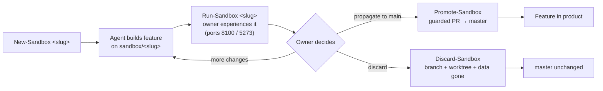

# Feature Sandbox Workflow — Proposal

- **Date:** 2026-08-04
- **Status:** Proposed — awaiting owner sign-off. Not implemented.
- **Type:** Dev-workflow / infrastructure (no product-behavior change).
- **Suggested owner lane:** Agent 3 (Infra). Scripts only; no `src/` or `frontend/src/` product code.

## 1. The ask

The owner wants a simple, low-complexity way to build and evaluate new features in
isolation, then keep or throw them away with one instruction:

> "Develop this new feature or improvement in the sandbox. Then I run the sandbox
> and experience that feature, and then I come and tell you: now propagate that to
> the main product, or discard it, or make a few more changes."

Concretely, each new feature should get:

1. A **parallel code branch** (nothing touches `master` until promoted).
2. A **parallel runnable environment** — the owner can start it and actually use
   the feature in a browser, *alongside* the normal stack, without disturbing it.
3. **Clean lifecycle verbs**: create → run → **promote** | **discard** | **iterate**.

The design goal is *low complexity*: reuse what already exists, add only thin
wrappers, and make the whole thing reversible by construction.

## 2. Why this is a small change (what already exists)

The repository already has every hard primitive needed. The sandbox is a thin,
owner-facing layer over these — not new infrastructure.

| Capability | Already provided by | Notes |
| --- | --- | --- |
| Isolated branch + worktree + VS Code window | [`scripts/dev/agent-worktree.ps1`](../../../../scripts/dev/agent-worktree.ps1) | `-Create <name>` makes branch `agents/<name>` from `origin/master`, copies `.env`, opens VS Code. `-Remove` enforces clean + merged. |
| Parametrized dev stack on custom ports | [`scripts/dev/dev-spa.ps1`](../../../../scripts/dev/dev-spa.ps1) | `-ApiPort` / `-FrontendPort` / `-LabsPort`, force-clears stale ports, validates uniqueness. Sets `VITE_API_TARGET`, `VITE_PORT`. |
| Selectable, isolated data backend | `dev-spa.ps1` `-CosmosBackend emulator\|azure`, `-UseCanaryData` | Local Cosmos emulator on `:8081` supports **many databases**; today it hardcodes `tripplanner-local`. |
| Env-driven frontend port + API proxy | [`frontend/vite.config.ts`](../../../../frontend/vite.config.ts) | `port = VITE_PORT`, `strictPort`, `/api` → `VITE_API_TARGET`. |
| Guarded integration to `master` | `scripts/user/Sync-MeTo-Latest.cmd`, `rerere`, MasterAgent merge flow | Promotion reuses this — never a raw force-push. |
| Data copy/seed | [`scripts/cosmos_copy.py`](../../../../scripts/cosmos_copy.py) | Optional realistic seed for a sandbox database. |

The sandbox model is essentially the **generalization of the existing
worker-isolated-port rule** ("a worker may start the dev stack on dedicated
worker-specific ports, isolated from canonical ports and data") into a named,
owner-runnable feature environment.

## 3. Design principles

- **Zero heavy infra.** Thin wrappers over `agent-worktree.ps1` + `dev-spa.ps1`.
- **Full isolation.** Separate branch **+** worktree **+** ports **+** data database,
  so a sandbox never touches canonical `:5173` / `:8000` / `tripplanner-local`, and
  never touches `master`.
- **Owner-runnable, side-by-side.** The sandbox runs on its own port block, so the
  canonical MasterAgent stack keeps running untouched. This respects the rule that
  workers must not start/stop the canonical stack — the sandbox is a *different*
  stack on *different* ports.
- **Reversible by construction.** Nothing lands in the product until an explicit
  **promote**. Discard leaves `master` unchanged.
- **One mental model, four verbs.** create → run → promote | discard | iterate.

## 4. The sandbox model

A **sandbox** = one feature under evaluation, identified by a short slug
(e.g. `map-drag-edit`):

| Facet | Value | Isolation guarantee |
| --- | --- | --- |
| Branch | `sandbox/<slug>` | Distinct namespace from worker lanes (`agents/*`). Never merged until promote. |
| Worktree | `C:\repos\tripplanner.worktrees\sbx-<slug>` | Own `.venv` + `node_modules` (never shared — editable install must resolve the right checkout). |
| Ports (v1, single slot) | API `8100`, Frontend `5273`, Labs `5275` | Fixed offset block; never collides with canonical `8000` / `5173` / `5175`. |
| Data | Emulator database `tripplanner-sbx-<slug>` | Separate database inside the same local emulator; writes stay in the sandbox DB. |

Multiple concurrent sandboxes are a later phase (indexed port blocks); v1 runs one
sandbox at a time next to the canonical stack, which covers the owner's "run the
sandbox and experience it" loop.

## 5. Owner-facing verbs (the whole workflow)

Proposed thin wrappers under `scripts/user/` (owner-facing) that call the existing
`scripts/dev/` helpers. Names map 1:1 to how the owner already talks about it:

| Verb | Command (proposed) | What it does |
| --- | --- | --- |
| **Create** | `New-Sandbox.cmd <slug>` | `agent-worktree.ps1` create with branch `sandbox/<slug>`; run `setup-dev-machine.ps1 -SkipToolInstall`; register slug + ports + data DB in a small registry; optionally seed data. |
| **Run** | `Run-Sandbox.cmd <slug>` | `dev-spa.ps1` with the sandbox's ports + `COSMOS_DATABASE=tripplanner-sbx-<slug>`; prints `http://localhost:5273`. Canonical stack stays up on `:5173`/`:8000`. |
| **Promote** | `Promote-Sandbox.cmd <slug>` | Sync `sandbox/<slug>` to latest `master`, run validation (pytest / build), open the guarded PR (or hand to MasterAgent merge) → `master`. Feature enters the product. |
| **Discard** | `Discard-Sandbox.cmd <slug>` | Stop the stack, remove worktree + delete branch (force path for unmerged, with confirmation), drop the sandbox database. `master` untouched. |
| **List** | `List-Sandboxes.cmd` | Registry table: slug, branch, ports, data DB, status. |

### Lifecycle

## 6. Two tiny enabling tweaks to existing scripts

The wrappers need only small, additive changes (each low-risk):

1. **`dev-spa.ps1`** — allow a custom emulator database name (today emulator mode
   hardcodes `COSMOS_DATABASE = "tripplanner-local"`). Add an optional
   `-CosmosDatabase <name>` param that, in emulator mode, overrides that one line.
   ~5 lines. Guard: refuse hosted/production database names.
2. **`agent-worktree.ps1`** — either add a branch-prefix option so it can create
   `sandbox/<slug>` (instead of `agents/<slug>`) and a confirmed `-Force` remove for
   an *unmerged* discard, **or** keep sandbox logic entirely in the new
   `New/Discard-Sandbox` wrappers and leave the worker tool untouched. Preference:
   keep the worker tool untouched and put sandbox specifics in the wrappers.

No product code (`src/`, `frontend/src/`) changes for v1.

## 7. How the agent builds inside a sandbox

When the owner says *"develop feature X in the sandbox"*:

1. `New-Sandbox x` (owner or agent).
2. The agent implements feature X **on `sandbox/x`** in that worktree, with focused
   tests, committing and pushing normally.
3. The agent validates server-free (pytest / tsc / build), or on the sandbox ports
   for Playwright — never on canonical ports.
4. Owner runs `Run-Sandbox x`, uses it in the browser at `http://localhost:5273`.
5. Owner decides:
   - *"propagate to main"* → `Promote-Sandbox x` (guarded PR → `master`).
   - *"discard"* → `Discard-Sandbox x`.
   - *"a few more changes"* → agent iterates on `sandbox/x`; owner re-runs.

## 8. Data isolation & seeding

- **Default:** dedicated emulator database `tripplanner-sbx-<slug>` (empty).
- **Optional realistic seed:** copy trips from `tripplanner-local` (or a canary
  snapshot) via `scripts/cosmos_copy.py` so the owner tests against real-looking
  itineraries. Sandbox writes stay in the sandbox DB.
- **Hard guard:** never point a sandbox at production/canary write targets; the
  wrapper refuses non-sandbox database names.

## 9. Feature flags (optional, complementary — not in v1)

Branch-based keep/revert already satisfies the ask. A tiny config-driven flag
registry could later let a *promoted* feature be dark-launched and toggled in the
main product without a second branch (gradual rollout). Deferred unless the owner
wants staged rollouts — it is not needed for "keep or discard".

## 10. Safety / guardrails

- Sandbox ports and DB are distinct from canonical; the MasterAgent stack is never
  touched.
- Promotion always flows through the existing guarded merge (green tests + PR),
  never a direct force-push to `master`.
- Discard is reversible until promoted (the branch can be kept if unsure);
  force-delete of an unmerged branch requires explicit confirmation.
- `.venv` / `node_modules` are per-worktree, never shared (one-time setup per
  sandbox).
- One interactive stack per port block; concurrent sandboxes need distinct offsets
  (later phase).
- Respects existing invariants: single LangGraph trip agent, no auto-deploy, owner
  consent for functional changes, MasterAgent owns the canonical stack.

## 11. Bounded v1 (minimal, clean)

- Single active sandbox slot: ports `8100` / `5273` / `5275`, emulator DB
  `tripplanner-sbx-<slug>`.
- Five owner verbs (`New` / `Run` / `Promote` / `Discard` / `List`) + the two tiny
  script tweaks + a small JSON sandbox registry.
- Optional manual seed.
- **Excluded from v1:** feature-flag system, multiple concurrent sandboxes, hosted
  sandbox deploy.

## 12. Later phases (optional)

- **Concurrent sandboxes:** indexed port blocks (`8100+i` / `5273+i`) + registry.
- **Hosted sandbox:** ephemeral Container App revision + isolated database reusing
  the `infra/deploy-canary.ps1` pattern, for testing on a phone or sharing. Requires
  cost + explicit owner approval.
- **Feature-flag dark launches** for post-promotion rollout.
- **VS Code Tasks** entries so the verbs appear in the command palette.

## 13. Effort & risk

- **v1 effort:** Small. Mostly wrappers + two ~5-line script edits + a JSON registry.
- **Risk:** Low and additive — no change to the canonical stack, no product-behavior
  change, nothing lands in `master` without an explicit guarded promote.

## 14. Acceptance criteria

- Owner can **create**, **run** (on isolated ports + data), and **experience** a
  feature without disturbing the canonical `:5173` / `:8000` stack.
- **Promote** lands the feature in `master` via a guarded PR with green validation.
- **Discard** removes all sandbox traces (branch, worktree, data); `master` is
  unchanged.
- **Iterate** works by re-running after new commits on the same branch.

## 15. Open decisions for the owner

1. **Data:** dedicated emulator DB per sandbox (recommended) vs. per-sandbox JSON dir.
2. **Seed:** copy real trips into a new sandbox by default? (recommended optional.)
3. **Concurrency:** one sandbox at a time for v1 (recommended) vs. multiple from day one.
4. **Feature flags:** include the optional flag layer now or defer (recommended defer).
5. **Branch namespace:** `sandbox/<slug>` (recommended) vs. reuse `agents/<slug>`.
