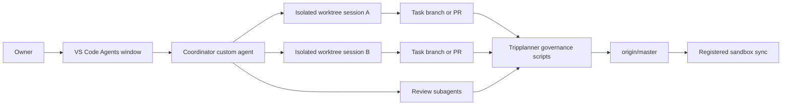

# Native Coding-Agent Orchestration - August 2026

Verified 2026-08-18 against official VS Code, GitHub Copilot, Anthropic Claude
Code, Cursor, OpenAI Agents SDK, and Microsoft AutoGen documentation. These
products are changing quickly; re-verify Preview and Experimental capabilities
before replacing working repository automation.

**Headline: VS Code now supplies most of the generic runtime we built for
parallel coding agents.** It can host persistent sessions, isolate local agents
in Git worktrees, monitor several tasks from one window, delegate to subagents,
and hand work between Copilot, Claude, Codex, and cloud agents. Tripplanner can
eventually replace its custom process, worktree, and session-management layer,
but should retain a thin repository-specific policy layer for authorization,
exact commit evidence, validation, publication, and sandbox synchronization.

This document informs a tooling decision. It does not approve removal or
replacement of the current controller in
[`../../scripts/dev/multiagent.py`](../../scripts/dev/multiagent.py).

## 1. Why this question matters

Tripplanner's controller currently solves two different problems:

1. **Generic agent execution:** start workers, isolate them in worktrees, retain
   state, monitor progress, recover failed processes, and move messages between
   sessions.
2. **Repository governance:** require owner authorization, assign lane ownership,
   verify exact remote commits, validate changes, publish through pull requests,
   advance `master`, and synchronize registered sandboxes.

The first category is becoming standard IDE infrastructure. The second category
is local policy that no general-purpose IDE can infer safely. Keeping that
distinction prevents us from maintaining commodity runtime code while also
preventing a Preview feature from silently weakening the repository's controls.

## 2. VS Code's native platform

The strongest fit is the platform already installed. The machine used for this
research had VS Code `1.133.0` and GitHub Copilot CLI `1.0.80`; Claude Code,
Codex CLI, and Cursor were not installed. VS Code can still expose Claude and
Codex as additional harnesses when their required providers are configured.

### Agents window

The [Agents window](https://code.visualstudio.com/docs/agents/run/agents-window)
is a dedicated agent-first VS Code window. It provides:

- one session list across workspaces;
- parallel local and cloud sessions with status and change counts;
- Copilot, Claude, Codex, Local, and cloud harness selection;
- side-by-side session review;
- session-scoped files, diffs, terminals, tasks, and browser state;
- commit and sync actions; and
- background dispatch without switching away from the current session.

For Copilot, Claude, and Codex sessions running locally, the user can select a
new Git worktree and a base branch. VS Code creates a new branch and worktree,
starts from committed state, and keeps changes outside the active checkout.
Ignored dependencies and environment files are not copied automatically, but
`git.worktreeIncludeFiles` can include selected ignored paths.

Worktree isolation is source isolation, not a security sandbox. It does not by
itself restrict commands, network access, or paths outside the worktree.

The window also supports validation tasks in the active session's worktree.
Tasks can be saved in the workspace or user profile and can run automatically
when a session worktree is created. That is a natural place for Tripplanner's
focused tests and setup checks.

### Agent Host

The [Agent Host](https://code.visualstudio.com/docs/agents/concepts/agent-host)
runs coding agents in a dedicated process instead of tying them to an editor
extension host. It provides:

- sessions that continue while no editor client is attached;
- multiple clients observing and controlling the same session;
- a common session model for different agent implementations;
- local or remote execution next to the workspace; and
- reconnectable state for chats, terminals, and changesets.

The host communicates through the open
[Agent Host Protocol](https://microsoft.github.io/agent-host-protocol/), a
JSON-RPC protocol with ordered state updates and reconnection. This is a more
appropriate owner for persistent agent processes than repository Python code.

The Agent Host and protocol are explicitly under active development. They are
promising infrastructure, not yet a reason to delete a proven fallback.

### Session orchestration and subagents

In supported Agent Host sessions, agents can use built-in session tools to:

- list sessions and inspect status, workspace, and file-change metadata;
- create another session or another chat in an existing session;
- read recent context from another session; and
- send a message that starts or steers work in another session.

Cross-session sends require user confirmation and fan-out is capped. This is a
sound interactive safety boundary, but it means VS Code does not yet reproduce
a fully unattended controller loop by itself.

Native subagents cover coordinator-worker decomposition inside one session.
They can run in parallel, use specialized instructions, models, and tools, and
return bounded results to the parent. Use them for research, planning, review,
and other tasks whose outputs can be summarized. Use separate worktree sessions
for independent implementations: peer chats in one session share the same
folder or worktree, so they do not provide write isolation from one another.

### Portable customization

VS Code supports repository and user customizations for:

- custom agents;
- Agent Skills;
- instruction files;
- hooks;
- MCP servers; and
- plugins.

Tripplanner's Coordinator, Implementer, Reviewer, and Validator behavior can be
expressed largely as custom agents and skills rather than Python-built prompts.
Skills follow an open format and are usable by VS Code, Copilot CLI, and Copilot
coding agents. Harness-specific behavior still needs verification because not
every harness exposes every VS Code or extension tool.

## 3. Other products and frameworks

### Claude Code

Claude Code currently documents the deepest local supervisor implementation
reviewed here.

Its [agent view](https://code.claude.com/docs/en/agent-view) can dispatch many
background sessions, show which need input, attach and detach terminals, retain
state on disk, restart failed processes, and associate sessions with pull
requests. A per-user supervisor keeps active work running without an attached
terminal and can restore sessions after sleep or process restart.

Background sessions automatically enter isolated Git worktrees before editing.
Claude Code blocks edits and shell command shapes that could redirect an
isolated session into the protected checkout. It can commit and push its own
branch, but is instructed not to push directly to `main` or `master`, force-push,
or merge. It also supports isolated subagent worktrees and conservative cleanup
that retains uncommitted or unpushed work.

Cross-session messaging allows independent local sessions to share findings or
status. Claude also offers agent teams for a leader-managed shared task list and
worker communication.

Important limitations:

- Agent view is a Research Preview.
- Agent teams are Experimental.
- Local background work stops when the machine shuts down, though state can be
  resumed.
- Parallel sessions consume quota independently.
- Cross-session messaging has platform and provider restrictions.

Claude Code is worth testing as a harness inside VS Code, not as a reason to
move the repository to another IDE or immediately adopt a second control plane.

### Cursor

[Cursor Cloud Agents](https://cursor.com/docs/cloud-agent) run in isolated
managed virtual machines. They clone a repository, work on a separate branch,
run builds and tests, and push changes for pull-request handoff. They support
parallel and multi-repository work, MCP, hooks, configurable environments,
artifacts, and remote desktop control.

Cursor's managed environment is stronger isolation than a local Git worktree,
and its artifacts are useful for visual review. The tradeoffs are a separate IDE
and account workflow, usage-priced cloud execution, and another policy surface.
VS Code now covers enough of the same local orchestration needs that migration
would add complexity without a clear Tripplanner-specific benefit.

### GitHub Copilot SDK

The [GitHub Copilot SDK](https://github.com/github/copilot-sdk) is generally
available for Python, TypeScript, Go, .NET, Rust, and Java. It wraps the Copilot
CLI server over JSON-RPC, manages the CLI process lifecycle, and exposes custom
agents, skills, tools, hooks, permissions, and MCP.

If Tripplanner still needs programmatic orchestration after adopting native VS
Code sessions, the SDK is a better integration boundary than invoking and
parsing interactive CLI subprocesses directly. It still does not supply the
repository's GitHub authorization, integration, and synchronization policy.

### General multi-agent frameworks

The [OpenAI Agents SDK](https://openai.github.io/openai-agents-python/multi_agent/)
supports manager agents, agents-as-tools, handoffs, code-defined routing,
parallel execution, sessions, tracing, and guardrails.

[Microsoft AutoGen](https://microsoft.github.io/autogen/stable/user-guide/agentchat-user-guide/index.html)
provides agents, teams, selector group chat, swarms, graph workflows, memory,
logging, and serialization.

These are application orchestration frameworks. They do not provide a complete
coding-workspace lifecycle with Git worktrees, branches, exact remote SHAs,
pull-request publication, IDE review, and cleanup. Adopting one would replace
our small controller with a general framework plus custom Git infrastructure,
which is not the simplification sought here.

## 4. Capability matrix

| Requirement | VS Code native | Other strong option | Tripplanner policy still needed |
| --- | --- | --- | --- |
| Parallel session dashboard | Agents window | Claude agent view, Cursor | No |
| Durable local process host | Agent Host | Claude supervisor | Fallback while Preview |
| Git worktree creation | Copilot/Claude/Codex sessions | Claude automatic worktrees | Base freshness rules |
| Write isolation | Separate worktree sessions | Claude enforced worktree isolation | Collision policy |
| Specialized worker roles | Custom agents and subagents | Claude subagents, Cursor rules | Repository instructions |
| Cross-session steering | Session-management tools | Claude messaging/teams | Owner approval policy |
| Issue-backed cloud execution | Copilot cloud agent | Cursor Cloud Agents | Claim and label protocol |
| Validation | Session tasks, agent tools | Hooks and cloud builds | Required command selection |
| Exact worker commit evidence | Git changes and branches visible | PR association | Yes: verify exact remote SHA |
| Integration ordering | Manual review and merge | PR workflows | Yes: deterministic gate |
| Publish Coordinator to `master` | Generic commit/PR actions | Generic PR actions | Yes |
| Synchronize registered sandboxes | No | No | Yes |
| Durable audit and recovery policy | Session history/export | Vendor session state | Yes |

## 5. What can eventually be retired

After a successful pilot, native VS Code sessions could replace:

- fixed worker-slot processes;
- reusable `multiagent/slot-1` and `multiagent/slot-2` branches;
- most process startup, monitoring, and restart code;
- manual worktree provisioning and routine cleanup;
- the custom worker-status presentation;
- some assignment prompt construction; and
- session state that exists only to supervise an agent process.

Dynamic worktree sessions remove the artificial two-worker ceiling and avoid
reusing mutable slot branches. Native session state also gives the owner a
better place to inspect, steer, and resume agents than a repository-specific
terminal controller.

## 6. What should remain

Retain a thin deterministic layer for:

- owner authorization and issue-claim policy;
- synchronization with current `origin/master` before work begins;
- lane ownership and incompatible-footprint checks;
- exact pushed commit and remote-SHA verification;
- targeted validation requirements;
- integration order and pull-request publication;
- protected advancement of primary `master`;
- synchronization of registered sandboxes after publication; and
- audit records and recovery checks that must survive a vendor UI change.

Prefer scripts, tasks, skills, and hooks for these controls. A long-running
custom daemon should remain only where native session APIs cannot express a
required deterministic transition.

## 7. Recommended target architecture

The IDE owns sessions, processes, worktrees, models, and human interaction. The
repository owns what counts as authorized, validated, publishable, and complete.

## 8. Staged adoption plan

1. **Pilot without removing anything.** Enable the Agent Host, open the Agents
   window, and retain the current controller as the fallback.
2. **Represent roles natively.** Add Coordinator, Implementer, Reviewer, and
   Validator custom agents plus reusable repository skills.
3. **Run two bounded tasks.** Start each in a separate `New Worktree` session
   from the same verified `origin/master` baseline.
4. **Exercise the failure cases.** Confirm process recovery, owner questions,
   worktree preservation, validation, conflicting footprints, and stale-base
   handling rather than testing only successful edits.
5. **Keep publication deterministic.** Feed native session results into the
   existing exact-SHA integration and Coordinator publication path.
6. **Compare evidence.** Record supervision failures, recovery effort, token
   usage, owner intervention, elapsed time, and leftover Git state.
7. **Retire one layer at a time.** Remove worker process supervision first,
   then native-owned worktree and session state. Remove fixed slot branches only
   after the replacement has completed real tasks and recovered a failed one.

## 9. Recommendation

Do not migrate to Cursor and do not introduce AutoGen, LangGraph, or the OpenAI
Agents SDK for repository orchestration. Adopt the VS Code Agent Host and Agents
window as the preferred execution surface, with Copilot initially and Claude or
Codex available as optional harnesses.

Keep the current controller stable during the pilot. The likely end state is
**native execution plus thin repository policy**, not either a fully custom
runtime or ungoverned vendor automation.

## Sources

- VS Code, [Use the Agents window](https://code.visualstudio.com/docs/agents/run/agents-window)
- VS Code, [Manage agent sessions](https://code.visualstudio.com/docs/agents/run/sessions/manage-sessions)
- VS Code, [Choose and use an agent harness](https://code.visualstudio.com/docs/agents/run/agent-harnesses)
- VS Code, [Agent Host architecture](https://code.visualstudio.com/docs/agents/concepts/agent-host)
- Microsoft, [Agent Host Protocol](https://microsoft.github.io/agent-host-protocol/)
- GitHub, [Copilot SDK](https://github.com/github/copilot-sdk)
- Anthropic, [Manage multiple agents with agent view](https://code.claude.com/docs/en/agent-view)
- Anthropic, [Run parallel sessions with worktrees](https://code.claude.com/docs/en/worktrees)
- Anthropic, [Message your other Claude Code sessions](https://code.claude.com/docs/en/cross-session-messaging)
- Cursor, [Cloud Agents](https://cursor.com/docs/cloud-agent)
- OpenAI, [Agent orchestration](https://openai.github.io/openai-agents-python/multi_agent/)
- Microsoft, [AutoGen AgentChat documentation](https://microsoft.github.io/autogen/stable/user-guide/agentchat-user-guide/index.html)
